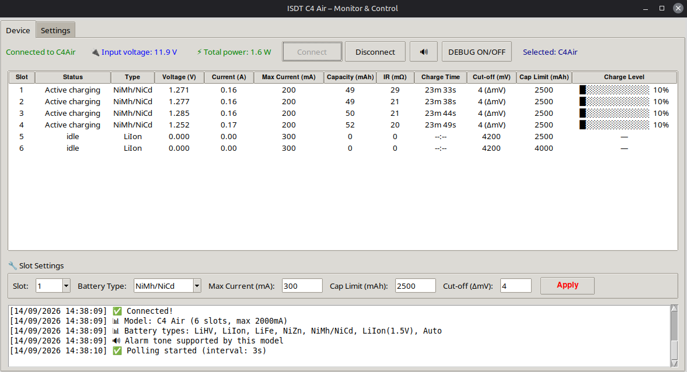
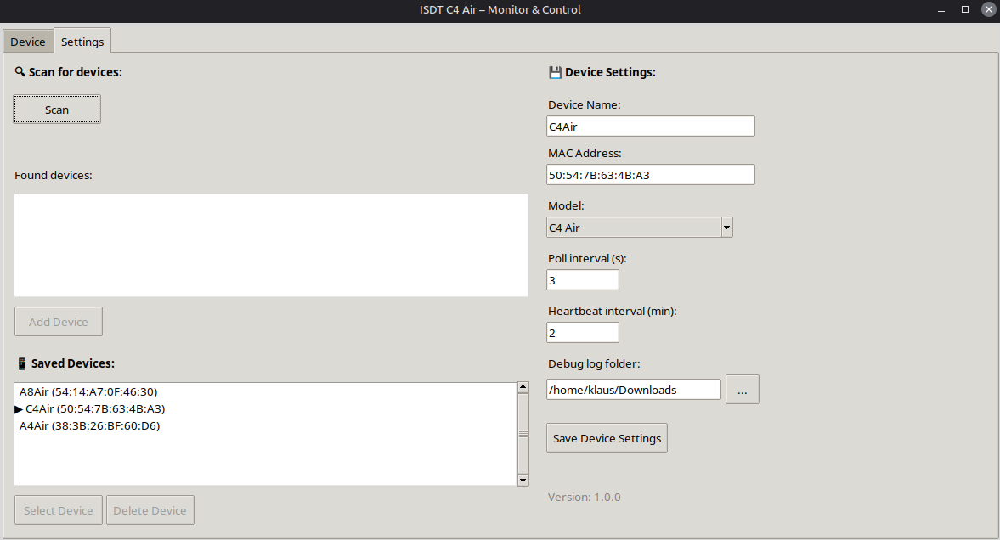

```markdown
``` 
# ISDT Charge Utility

**Linux GUI for ISDT C4 Air charger** – Direct Bluetooth Low Energy (BLE) connection.  
Monitor and control your charger with ease.


---

## 📸 Screenshots

| Main View | Settings |
|-----------|----------|
|  |  |

*(Replace with actual screenshots)*

---

## ✨ Features

### 📊 Monitoring
- **BLE Connection** – Direct communication with ISDT C4 Air
- **Auto-Connect** – Saved MAC address is used on startup
- **6 Channels (Slots)** – All charging data at a glance
- **Detailed Status** – Pre‑charge, CC, CV, done, error
- **Charge Time** – Read directly from the device
- **Battery Bar** – Visual representation of charge level
- **Input Voltage & Total Power** – Clear overview
- **Hardware Info** – Firmware and hardware version displayed on connect
- **Automatic Polling** – Regular data updates (interval adjustable)
- **Timeout Detection** – Detects when the device is powered off

### ⚡ Control
- **Set Battery Type** – LiHV, LiIon, LiFe, NiZn, NiMH, LiIon 1.5V, Auto
- **Set Charge Current** – 100–2000 mA (0.1–2.0 A)
- **Set Capacity Limit** – Battery‑specific ranges (0 = unlimited)
- **Set Cut‑off Voltage** – Battery‑specific ranges (0 = default)
- **Alarm Tone** – Toggle on/off with a single click (🔊/🔇)
- **Battery‑specific Validation** – Prevents invalid values
- **Persistent Settings** – MAC, device name, interval, Bind UUID are saved
- **Blueman Conflict Resolution** – Automatic disconnect when Blueman is active

---

## 🖥️ Supported Devices

| Model       | Status                    |
|-------------|---------------------------|
| ISDT C4 Air | ✅ Tested (full support)  |
| ISDT A8 Air | ⚠️ Theoretically compatible (read only) |
| ISDT NP2 Air| ⚠️ Theoretically compatible (read only) |
| ISDT MASS2  | ❌ Not supported          |

> **Note:** This software was developed specifically for the C4 Air. Other models may work but have not been tested.

---

## 📋 Requirements

- **Linux** (tested on Ubuntu/Debian, should work on other distributions)
- **Python 3.10 or higher**
- **Bluetooth adapter** (built-in or USB)
- **BlueZ** – Linux Bluetooth stack

---

## 🔧 Installation

### 1. Clone the repository

```bash
git clone https://github.com/DittelHome/ISDT-Charge-Utility.git
cd ISDT-Charge-Utility
```

### 2. Install Python dependencies

```bash
# Create and activate virtual environment (optional)
python3 -m venv .isdt
source .isdt/bin/activate

# Install required packages
pip install bleak
```

or:

```bash
sudo apt install python3-bleak
```

### 3. Run the application

```bash
python3 isdt.py
```

---

## 🚀 Usage

### First Start

1. **Pair the device in Blueman** (one-time)
   - Open Blueman Manager
   - Scan for devices
   - Select your ISDT device
   - Click "Pair"
   - Enter the PIN: `000000`

2. **Start the app**
   ```bash
   python3 isdt.py
   ```

3. **Scan and save your device**
   - Go to the **"Settings"** tab
   - Click **"Scan"**
   - Select your ISDT device from the list
   - Click **"Save selected device"**

4. **Connect**
   - Switch to the **"Device"** tab
   - Click **"Connect (saved)"**
   - The connection will be established and polling starts automatically

### Controlling Charging Parameters

1. **Select a slot**
   - Click on a row in the table, or
   - Use the **"Slot"** dropdown in the settings panel

2. **Adjust values**
   - **Battery type** – Choose from the dropdown
   - **Current** – Enter value in mA (100–2000)
   - **Capacity limit** – Enter value in mAh (0 = unlimited)
   - **Cut‑off** – Enter value in mV (0 = default; only if supported for the selected battery type)

3. **Apply**
   - Click the red **"Apply"** button
   - A **beep** confirms that the settings were sent
   - The charger will apply the new parameters immediately

4. **Alarm Tone**
   - Click the **speaker icon** (🔊/🔇) in the top bar to toggle the alarm on/off

### Battery‑specific Validation

The tool validates your input based on the selected battery type. Invalid values will show an error message.

| Battery Type | Capacity Limit (mAh) | Cut‑off (mV) |
|--------------|----------------------|--------------|
| LiHV         | 0 or 2000–7000       | 4250–4450    |
| LiIon        | 0 or 2000–7000       | 4100–4300    |
| LiFe         | 0 or 2000–7000       | 3550–3750    |
| NiZn         | 0 or 2000–7000       | 1800–2000    |
| NiMH         | 0 or 1000–4000       | 3–12 (Delta‑Peak) |
| LiIon(1.5V)  | 0 or 1000–4000       | none (0)     |
| Auto         | 0 or 2000–7000       | none (0)     |

---

## 📊 Displayed Data

| Column | Description |
|--------|-------------|
| **Slot** | Channel number (1-6) |
| **Status** | Charge state (idle, pre-charge, CC, CV, done, error) |
| **Type** | Battery chemistry (NiMH, LiIon, LiFe, etc.) |
| **Voltage** | Current battery voltage in volts |
| **Current** | Charge current in amperes |
| **Capacity** | Charged capacity in mAh |
| **IR** | Internal resistance in mΩ |
| **Charge Time** | Elapsed charging time (from device) |
| **Charge Level** | Battery bar with percentage |

---

## 📁 Project Structure

| File | Description |
|------|-------------|
| `isdt.py` | Main program (tkinter GUI) |
| `isdt_ble.py` | BLE communication (connection, polling, control) |
| `isdt_protocol.py` | Protocol definitions and parsers |
| `isdt_config.py` | Settings load/save |
| `isdt_limits.py` | Battery‑specific validation limits (customizable) |

---

## ⚙️ Configuration

Settings are stored in `~/.isdt_gui_config.json`:

```json
{
    "mac_address": "50:54:7B:63:4B:A3",
    "device_name": "ISDT C4 Air",
    "poll_interval": 5,
    "bind_uuid": "3c7a0e1ea9fb4919bb268c617e0ff89c"
}
```

---

## 🐛 Troubleshooting

### "Device with address ... was not found"

1. Make sure the charger is powered on
2. Close the ISD Link app on your smartphone
3. Click "Disconnect" and then "Connect" again

### "Device is rebooting sometimes"
Make sure you have a good USB‑C power adapter.  
The ISDT Charger requires 12 V, otherwise it won't charge Li‑ion batteries.

---

## 🔍 Debug Mode

To enable debug mode, set `debug=True` when initializing `ISDTBLE` in `isdt.py`:

```python
self.device = ISDTBLE(mac, log_callback=self.log_message, debug=True)
```

---

## 📝 Developer Notes

### Protocol

The BLE protocol is based on the documentation from the [Home Assistant Integration](https://github.com/mtheli/isdt_air_ble) for reading, and reverse‑engineered from the ISD Link Android app for writing. See [Protocol description](https://github.com/DittelHome/ISDT-Charge-Utility/blob/main/PROTOCOL.md)

---

## 💻 Platform Support

| Platform | Support |
|----------|---------|
| **Linux** | ✅ Fully supported |
| **Windows** | ⚠️ Only via WSL (Windows Subsystem for Linux) – not tested |
| **macOS** | ❌ Not tested |

The program is specifically designed for Linux and uses Linux‑specific tools (`bluetoothctl`).  

---

## 📜 License

MIT License – see [LICENSE](LICENSE) file.

---

## 🙏 Acknowledgments

- [mtheli/isdt_air_ble](https://github.com/mtheli/isdt_air_ble) – Home Assistant integration as protocol reference (read commands)
- [bleak](https://github.com/hbldh/bleak) – BLE library for Python

---

**Note:** This is an independent community project and is not affiliated with, endorsed by, or sponsored by ISDT.

